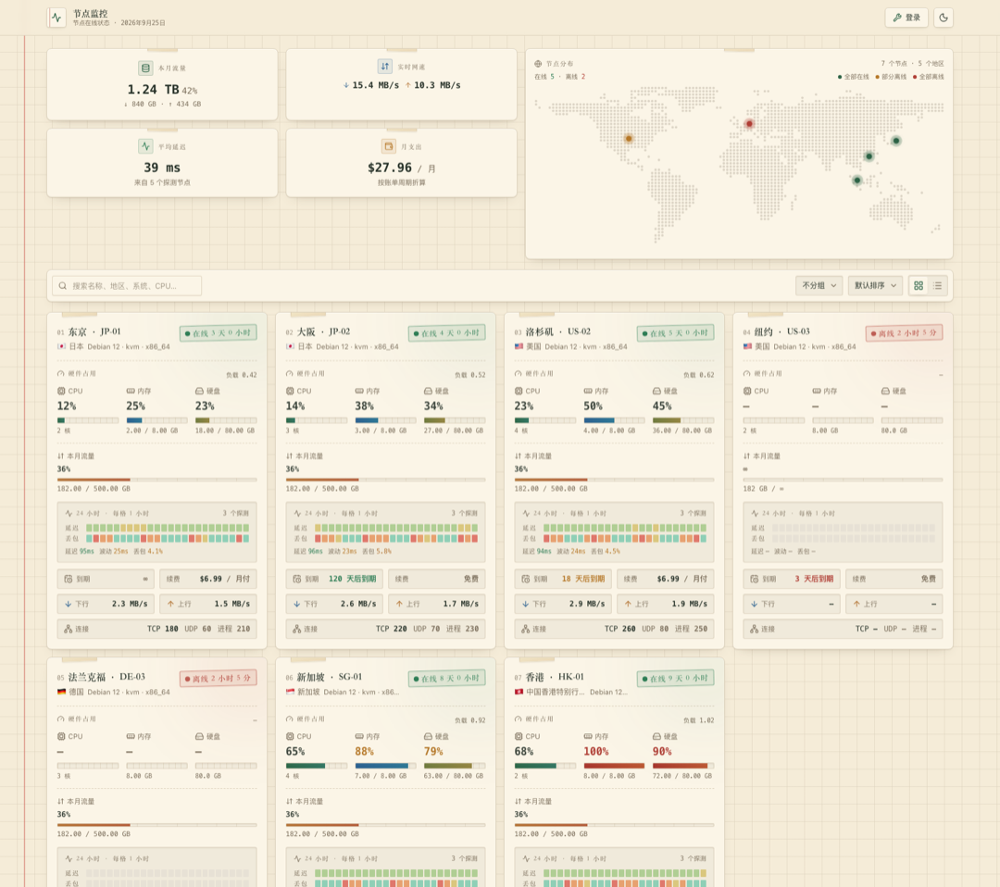

# noteee

> 复古笔记本 · 护眼纸感 · 卡片 / 列表双视图 · monitor 状态面板主题



noteee 是 [monitor](https://github.com/monitor-probe/monitor) 的第三方主题。米黄方格纸配墨绿墨水，
红色装订边线、贴在纸角的胶带、盖章式的在线状态、打字机等宽数字——把一堆服务器指标做成一本摊开的手账。

深浅色随系统自动切换，深色不是纯黑，而是墨绿纸。

## 护眼

- **纸不是白的**。浅色底是米黄（`oklch(0.945 0.028 88)`，约 `#f2e9d5`），深色底是墨绿（约 `#1f2a24`），
  都不是纯白 / 纯黑，长时间盯屏不刺眼
- **墨水不是黑的**。正文用深墨绿灰，标题用宋体，数字用等宽，对比度刻意压低
- **三档纸张色调**：米黄（默认）/ 淡青格纸 / 牛皮纸，在面板的「主题设置」里切换，整站生效
- 大面积色块一律低饱和：热力色带走彩色铅笔质感，进度条是实心墨水色而不是渐变光晕

## 特性

### 节点卡片（硬件占用优先）

- **硬件占用放在最上面、字号最大**：CPU / 内存 / 硬盘三列并排，百分比用大号等宽字体，
  进度条是带刻度的坐标纸轨道（每 10% 一根竖线），并附核数、负载与真实用量
- 本月流量独立一行，有额度时显示已用百分比，超 90% 转红
- 24 小时延迟 / 丢包热力色带：所有探测线路按小时求均值后合成单条色带，延迟与丢包两行共用一条 24 格时间轴
- 到期栏是纸上的小格，**格子底色与「到期」标签、日历图标固定不变**，只用「XX 天后到期」这行数值
  的颜色区分：>30 天或永不到期中性 / 绿色、≤30 天琥珀、≤7 天或已过期红色
- 上下行速率并排两格，方向只靠箭头颜色区分（下行钢笔蓝 / 上行琥珀）
- 连接一栏汇总 **TCP / UDP 连接数与进程数**
- 卡角贴胶带，在线状态是盖章样式，坏数据自动隔离不影响整页

### 列表视图

同一批数据的紧凑排布：名称（固定宽度）· 系统 · CPU · 内存 · 硬盘 · 流量 · 上下行 · TCP · 延迟色带 · 到期 · 费用。

- 延迟列复用卡片视图的 **24 小时热力色带**（同一个 `HeatRow` 组件、同一份多探测聚合数据，只是尺寸更紧凑），
  两个视图的延迟显示完全一致，不会出现两套画法或两套配色
- 名称列固定宽度、余量交给系统版本 / 流量 / 延迟三列按比例吸收，列与列逐行严格对齐
- 行用更小的投影档位（`.paper-row`）而不是卡片的，滚动时省一大截绘制开销

### 主面板

- 概览卡：本月流量（全站上下行合计，有额度时附已用百分比）/ 实时网速 / 平均延迟 / 月支出（按账单周期折算，多币种分列）
- 世界地图卡片：点阵世界地图按国家坐标标记节点位置，亮点按在线状态着色——全部在线为主题色、
  部分离线橙色、全部离线红色，并附图例与在线 / 离线计数；悬停看名称，点击展开地区节点列表，
  点击弹层外或按 Esc 关闭
- 搜索、分组 / 排序下拉与视图切换统一为「纸上的小格」样式
- 支持国家 / 状态 / 系统分组与六种排序
- WebSocket 实时推送，断线自动轮询与重连

### 详情页

四张指标卡（CPU 使用率 / 内存·硬盘 / TCP·UDP / 当前延迟）→ 资源与延迟图表 → 硬件配置、运行状态、
网络与流量、费用与到期信息卡片 → 备注。

- 资源 Tab：CPU / 内存 / 网络速率 / 磁盘历史曲线
- 网络延迟 Tab：多探测曲线，平滑与削峰可切换，可仅看单个探测
- 多节点延迟列表：当前 / 平均 / 波动 / 丢包，一键仅看
- 图表浮层跟随主题配色，深色下不会出现刺眼的白底

## 主题设置

在面板的「主题」页点设置按钮即可，站点级生效（存在 hub 数据库里，更新 / 重装主题都不会丢）：

| 设置 | 类型 | 默认 | 说明 |
| --- | --- | --- | --- |
| 公告 | 文本 | 空 | 显示在页面顶部，留空不显示 |
| 默认视图 | 卡片 / 列表 | 卡片 | 访客自己切换过的以访客的选择为准 |
| 纸张色调 | 米黄 / 淡青格纸 / 牛皮纸 | 米黄 | 整站配色基调 |
| 卡片最小宽度 | 数字 240–560 | 320 | 卡片视图里每张卡的最小宽度（px） |
| 显示节点分布地图 | 开关 | 开 | |
| 显示延迟色带 | 开关 | 开 | |
| 显示费用 | 开关 | 开 | 关闭后卡片、列表与详情页都不再画金额 |

访客自己的偏好（深浅色、视图、分组、排序）存在浏览器本地，不属于站点设置。

## 快速开始

```bash
npm install
npm run dev
```

指向一个现成的 hub（它要开着公开状态页）：

```bash
MONITOR_HUB=https://hub.example.com npm run dev
```

构建主题包：

```bash
npm run build
tar -czf theme.tar.gz dist theme.json preview.png
```

将 `theme.tar.gz` 上传到 monitor 后台即可安装。

## 主题契约

| 接口 | 说明 |
| --- | --- |
| `GET /api/me` | 站点名、登录状态、公开页开关 |
| `GET /api/nodes` | 节点列表、实时指标与累计流量 |
| `GET /api/nodes/{id}/metrics` | 历史指标与延迟记录（`series=metrics\|ping`） |
| `GET /api/ws` | 节点快照推送 |
| `GET /api/themes/noteee/config` | 站点设置（401 / 404 / 断网一律按默认值渲染） |

路由：详情页 `/node/{id}`。前面有按路径放行的反代或 WAF 时，把 `/node/` 加进白名单，
否则会出现「点进去正常，一刷新就被拦」。

## 技术栈

React 19 · Vite · Tailwind CSS 4 · Recharts · lucide-react

## 发布

源码仓库：<https://github.com/bluesmkun/noteee>

工作流放在 `.github/workflows.disabled/`：推送用的细粒度 PAT 没有 `workflow` 权限，
GitHub 会拒绝包含 `.github/workflows/` 的推送。在仓库网页上把目录重命名回 `.github/workflows/`
即可恢复 CI 与自动发版（推送 `v*` 标签后自动构建并发布 `theme.tar.gz` 与 `theme.tar.gz.sha256`，
面板可从 Release 一键更新）。

在此之前手动发版：

```bash
npm run build
tar -czf theme.tar.gz dist theme.json preview.png
shasum -a 256 theme.tar.gz | cut -d' ' -f1 > theme.tar.gz.sha256
```

`theme.tar.gz` 与校验文件只作为 Release 资产，不提交进仓库。
