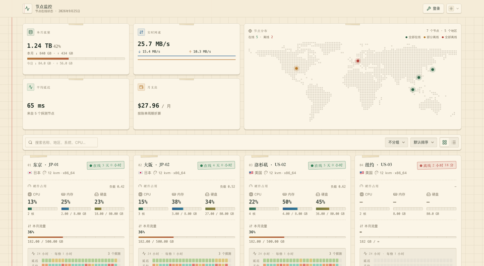
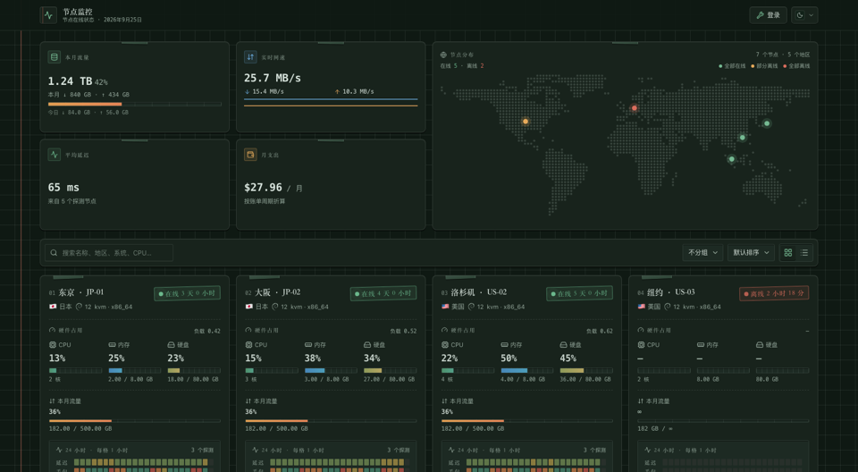
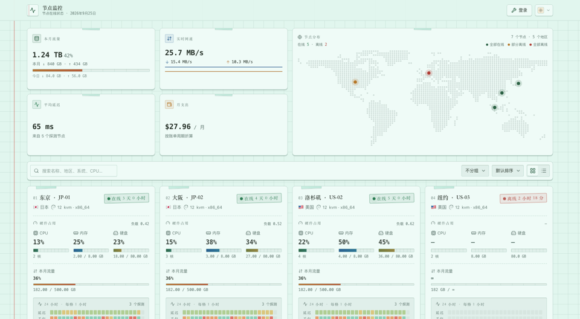
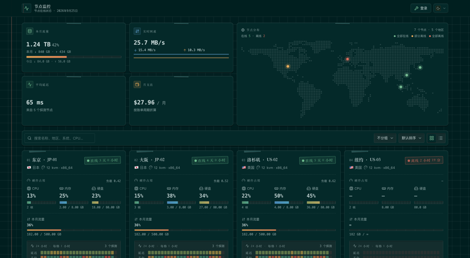
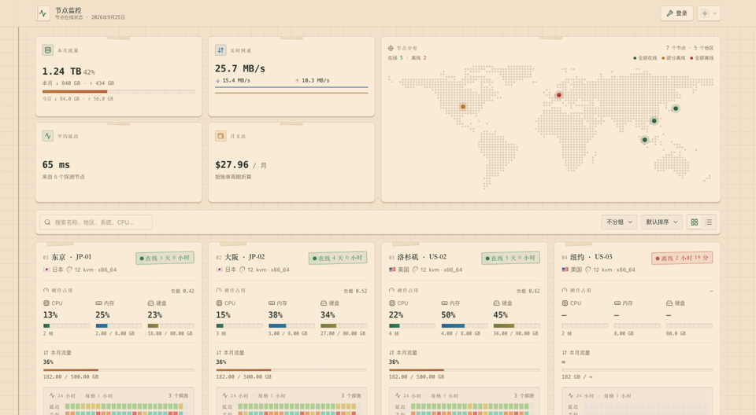
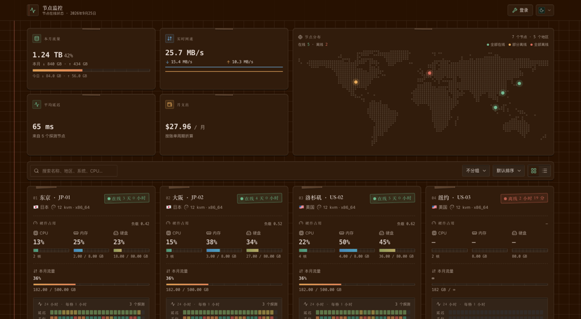
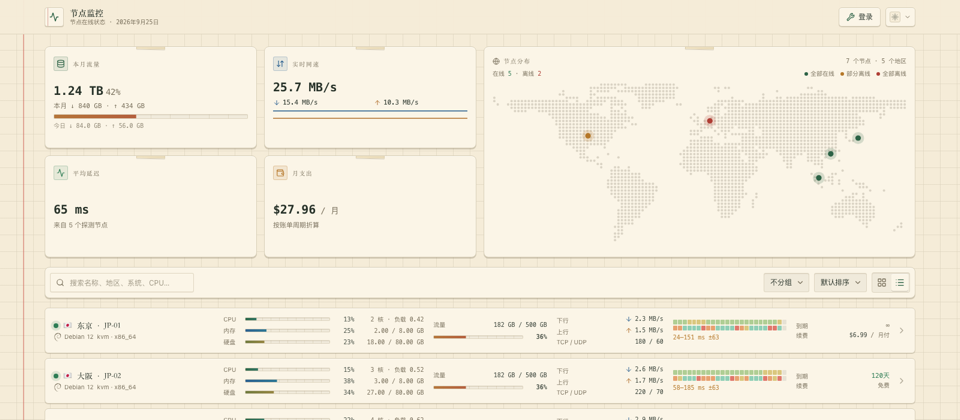
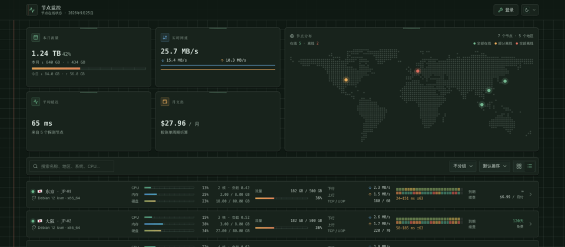

# noteee

> 复古笔记本 · 护眼纸感 · 卡片 / 列表双视图 · monitor 状态页主题

米黄方格纸配墨绿墨水，红色装订线、纸角胶带、盖章式的在线状态、打字机等宽数字——
把一堆服务器指标做成一本摊开的手账。纸不是纯白、墨水不是纯黑，长时间盯屏不刺眼。

页头右上角**一个按钮同时切换明暗和纸张**。

## 三种纸张

### 米黄（默认）

| 浅色 | 深色 |
| --- | --- |
|  |  |

### 淡青格纸

| 浅色 | 深色 |
| --- | --- |
|  |  |

### 牛皮纸

| 浅色 | 深色 |
| --- | --- |
|  |  |

## 列表视图

| 浅色 | 深色 |
| --- | --- |
|  |  |

## 特性

- **硬件占用放在最上面、字号最大**：CPU / 内存 / 硬盘三列并排，附核数、负载与真实用量
- **系统版本用发行版图标表示**：Debian 的旋涡、Ubuntu 的圆环、Alpine 的山、Windows 的四格……
- **24 小时延迟 / 丢包热力色带**：多条探测线路按小时求均值合成一条
- 到期日、续费金额、上下行速率、TCP / UDP 连接数与进程数一页看全
- **世界地图**按在线状态三色标记节点，点击展开该地区的节点列表
- 详情页有资源与延迟的历史曲线
- 搜索、按地区 / 状态 / 系统分组、六种排序

## 安装

面板「主题」页上传 `theme.tar.gz`，或把解包后的 `noteee/` 放进 hub 的 `--themes` 目录。
